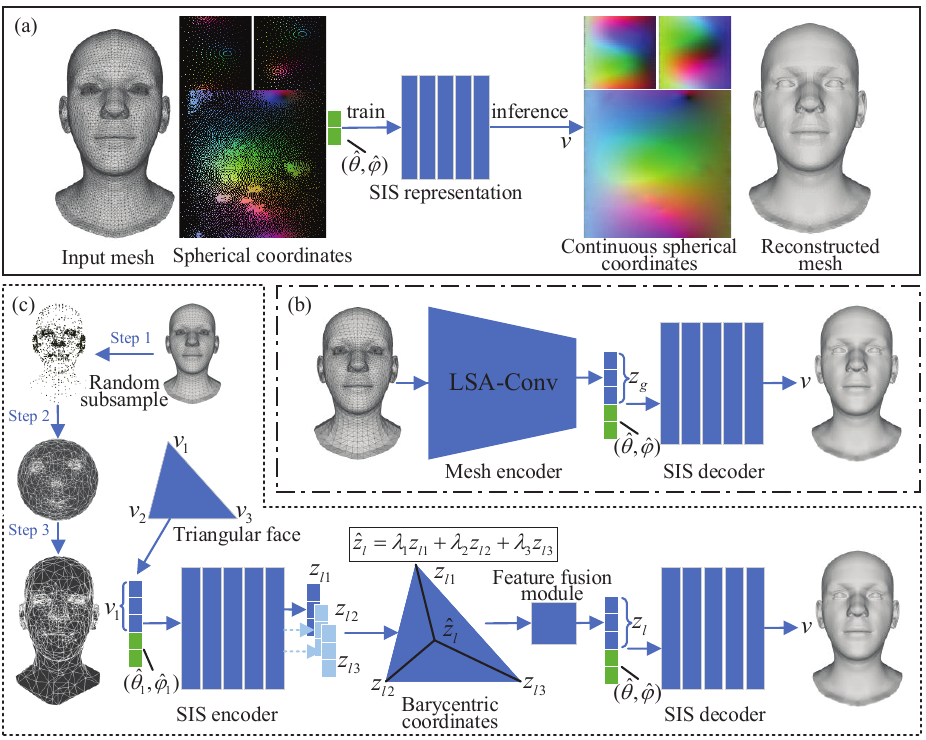
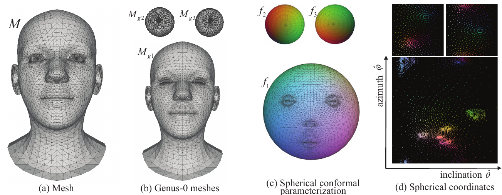
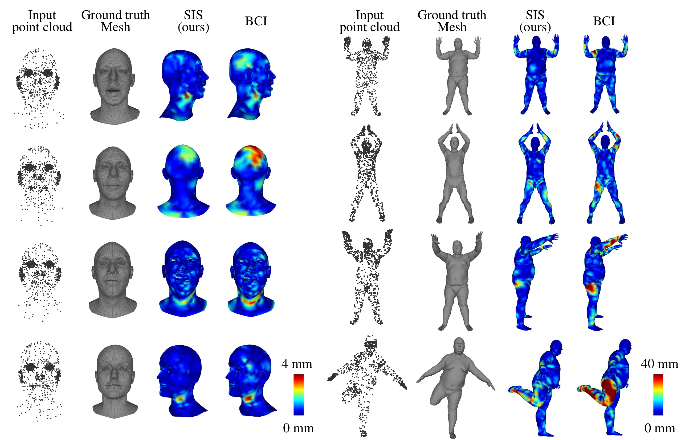

# Learning Continuous Mesh Representation with Spherical Implicit Surface


This repository is the official implementation of my paper: "Learning Continuous Mesh Representation with Spherical Implicit Surface"
# Project Abstract 
As the most common representation for 3D shapes, mesh is often stored discretely with arrays of vertices and faces. However, 3D shapes in the real world are presented continuously. In this paper, we propose to learn a continuous representation for meshes with fixed topology, a common and practical setting in many faces-, hand-, and body-related applications. First, we split the template into multiple closed manifold genus-0 meshes so that each genus-0 mesh can be parameterized onto the unit sphere. Then we learn spherical implicit surface (SIS), which takes a spherical coordinate and a global feature or a set of local features around the coordinate as inputs, predicting the vertex corresponding to the coordinate as an output. Since the spherical coordinates are continuous, SIS can depict a mesh in an arbitrary resolution. SIS representation builds a bridge between discrete and continuous representation in 3D shapes. Specifically, we train SIS networks in a self-supervised manner for two tasks: a reconstruction task and a super-resolution task. Experiments show that our SIS representation is comparable with state-of-the-art methods that are specifically designed for meshes with a fixed resolution and significantly outperforms methods that work in arbitrary resolutions.






# Repository Requirements

This code was written in Pytorch 1.10. We use tensorboardX for the visualisation of the training metrics. We recommend setting up a virtual environment using [Miniconda](https://docs.conda.io/en/latest/miniconda.html). To install Pytorch in a conda environment, simply run 

```
$ conda install pytorch torchvision -c pytorch
```

Then the rest of the requirements can be installed with 

```
$ pip install -r requirements.txt
```

### Mesh Decimation
For the mesh decimation code we use a function from the [COMA repository](https://github.com/anuragranj/coma) (the files **mesh_sampling.py** and **shape_data.py** - previously **facemesh.py** - were taken from the COMA repo and adapted to our needs). In order to decimate your template mesh, you will need the [MPI-Mesh](https://github.com/MPI-IS/mesh) package (a mesh library similar to Trimesh or Open3D). 


# Data Organization

The following is the organization of the dataset directories expected by the code:

* data **root_dir**/
  * **dataset** name/ (eg DFAUST)
    * template
      * template.obj
      * downsample_method/
        * downsampling_matrices.pkl (created by the code the first time you run it)
    * preprocessed/
      * sliced
        * train.npy (number_meshes, number_vertices, 3) (no Faces because they all share topology)
        * test.npy 
        * points_train/ (created by data_generation.py)
        * points_val/ (created by data_generation.py)
        * points_test/ (created by data_generation.py)
        * paths_train.npy (created by data_generation.py)
        * paths_val.npy (created by data_generation.py)
        * paths_test.npy (created by data_generation.py)

# Usage

#### Data preprocessing 

In order to use a pytorch dataloader for training and testing, we split the data into seperate files by:

```
$ python data_generation.py --root_dir=/path/to/data_root_dir --dataset=DFAUST --num_valid=100
```

#### Training and Testing

```
args['mode'] = 'train' or 'test'

python pai3DMM.py
```

#### Some important notes:
* The code has compatibility with both _mpi-mesh_ and _trimesh_ packages (it can be chosen by setting the _meshpackage_ variable pai3DMM.py).


#### Acknowlegements:

The structure of this codebase is borrowed from [Neural3DMM](https://github.com/gbouritsas/Neural3DMM).

# Cite

Please consider citing our work if you find it useful:

```
Z Gao, "Learning Continuous Mesh Representation with Spherical Implicit Surface", IEEE International Conference on Automatic Face and Gesture Recognition, FG 2023
```